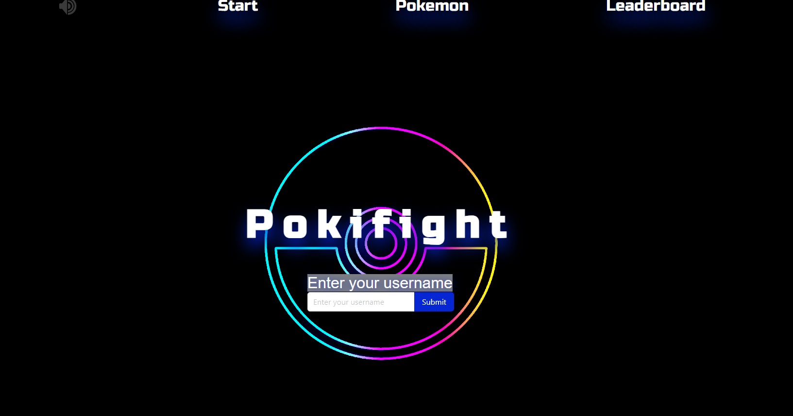
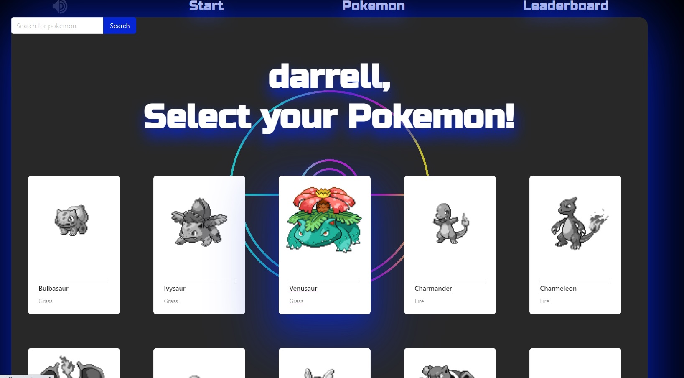
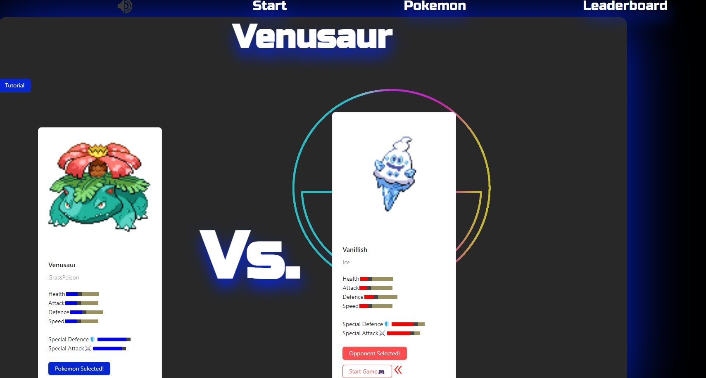
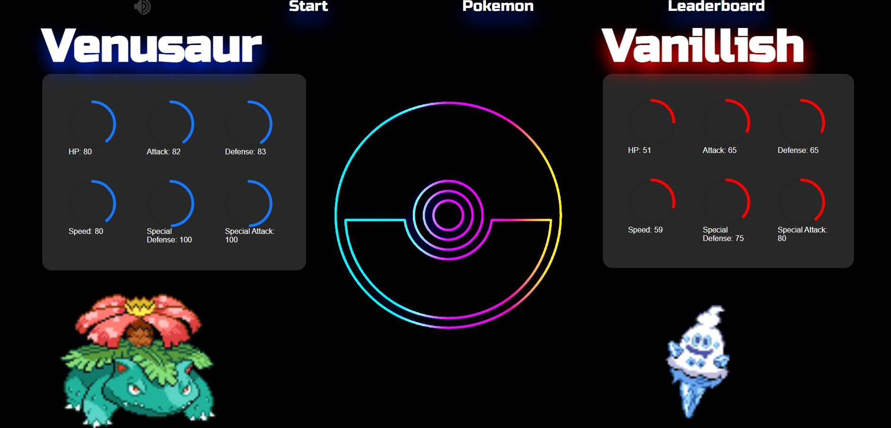
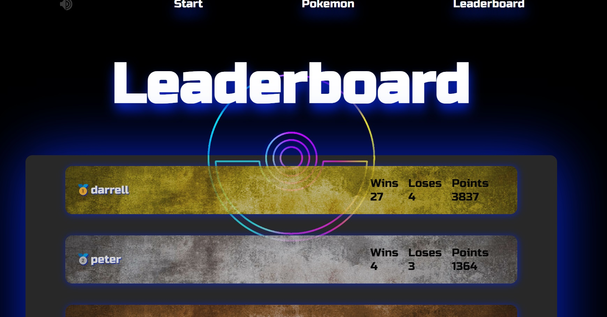

# Pokifight

This is a game created by myself and Shadoust (eshah64).

We used React.js library in the Frontend and the Express.js framework in the Backend.

We wrote this app in predominantly JavaScript.

See below for screenshots of the project (deployed on both nectlify and render):

Enter Username

Select your Pokemon (over 800 to choose from)

Select Opponent

Fighting screen

Leaderboard

Cheers,
Darrell

